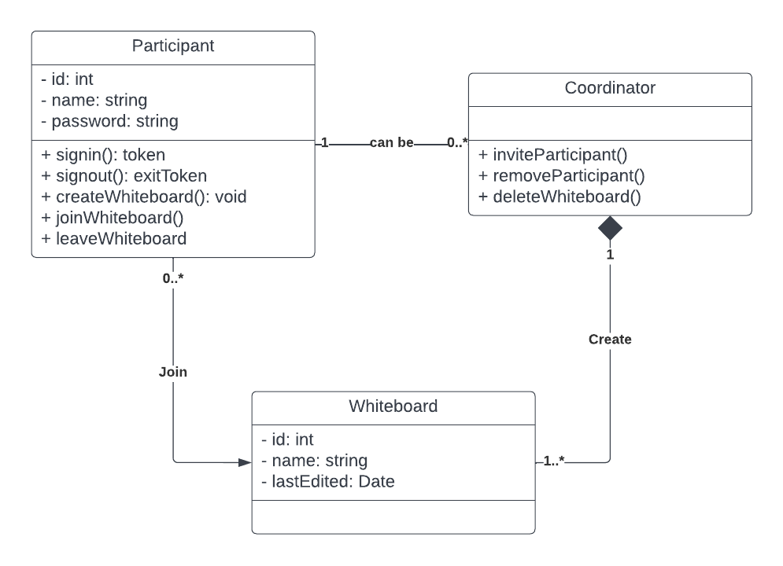
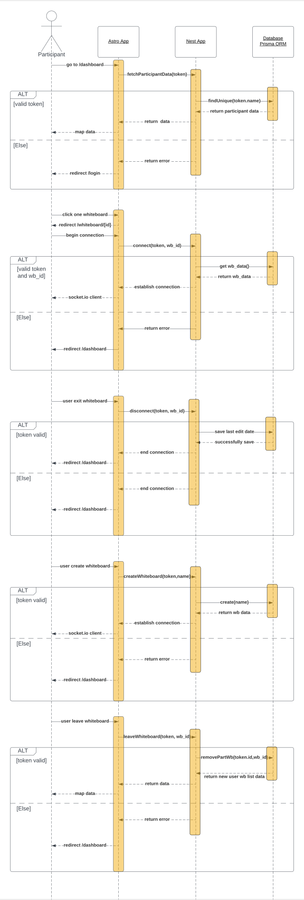
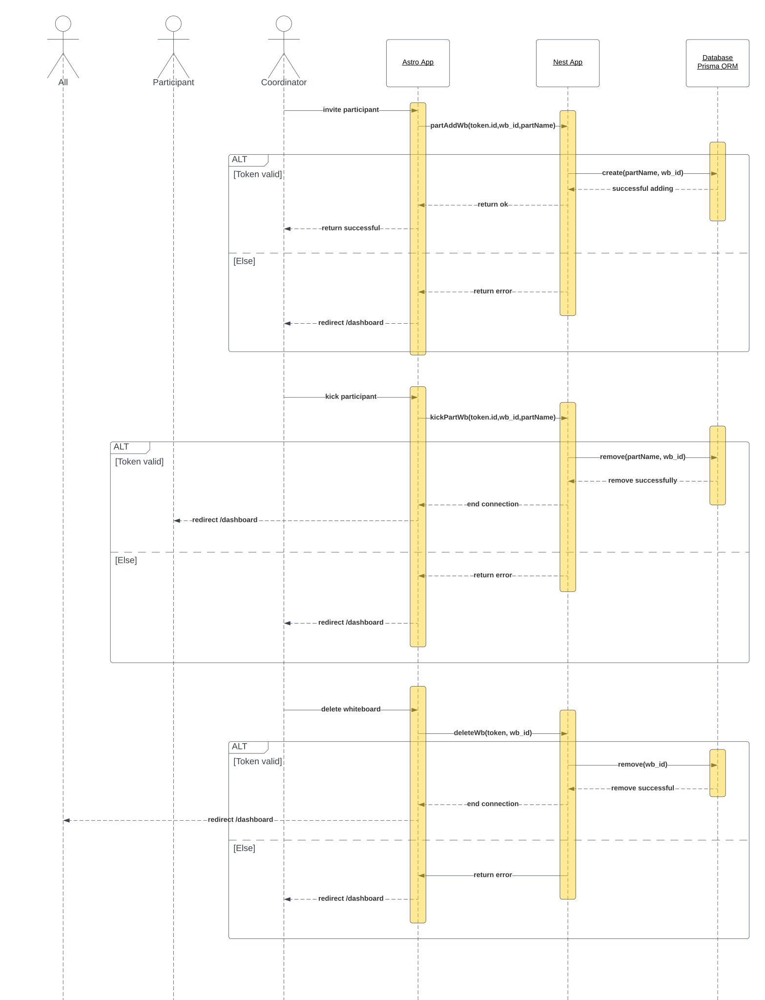
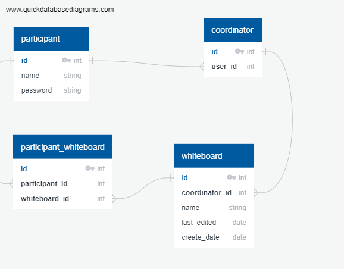

# Whiteboard by @han-tara
objective of this project is to implement some core technology for making real-time document editing app. This application use nest js as main framework, mariadb for database, jwt + refresh token for security, and socket.io for real time communication.

Section:
* [Setup](#installation)
* [Running](#running)
* [Requirements](#requirements)
* [UML Diagram](#uml-diagram)
* [ERD](#er-diagram)

# Setup
## Install packages
```
yarn install
```

## Docker compose (15-20 seconds to complete)
```
yarn db:restart
```

# Running
## Start nest server
```
yarn start:dev
```
## Get access token - via signup / signin (use postman)
```
> localhost:3000/auth/signup or signin
> body
{
    "name" : "name",
    "password" : "password"
}
```

## Open wb-edit.html
```
root/static/wb-edit.html
```

## Using the app
* copy access token into "access token input field" and press "set token"
* set your destination room (apabila ada pop up berarti berhasil masuk)
* start editing!

# Requirements
## User Requirement
* The application must be able to write whiteboards in real time, and each user can create or join other's whiteboards.

## System Requirements
* Application must have an authentication and authorization system
* Using a refresh token
* Using socket.io for real-time communication
* Using MariaDB for database
* Using astro for frontend
* every participant can create a whiteboard
* participant that creates the whiteboard is called a coordinator
* coordinator can invite or kick someone out of the whiteboard
* coordinator can delete the whiteboard
* every participant can only join another's whiteboard if invited by the coordinator

# UML Diagram

## Class Diagram



## Sequence Diagram
**Authenthication & Authorization**


**Participant dashboard, connect, disconnect, create, leave whiteboard**


**Coordinator**


## ER Diagram


